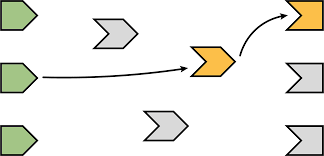
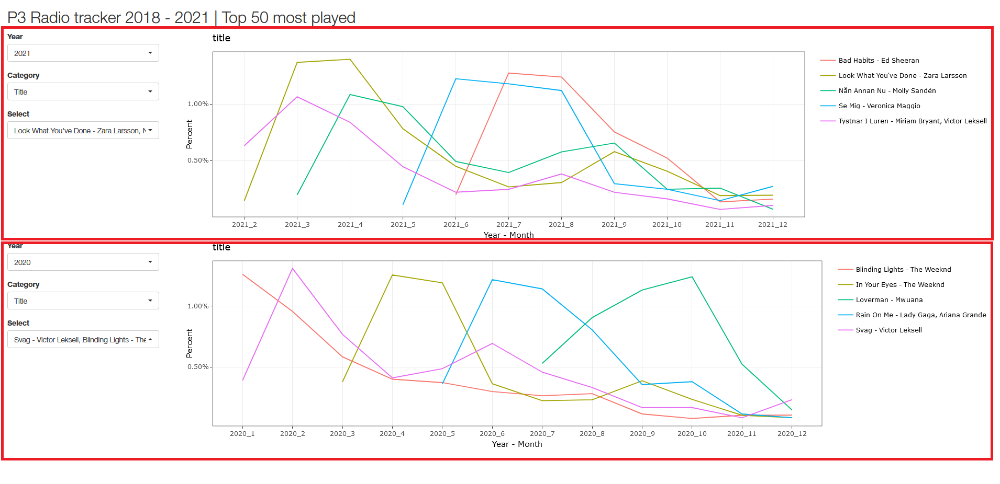

```{r setup, include=FALSE}
knitr::opts_chunk$set(echo = FALSE)
```

## Introduction

- Do you have the skills to make a web interface?
- R shiny enables web interface coding inside rstudio
- R shiny converts R to html, css and javascipt
- Purpose is to test the rumors and see for myself if it can be useful for
explorative analysis. 

## Data acquisition

- Sveriges Radio P3 API (No API-KEY required)
- Years 2018 to 2021
- What the processed data looked like (title, artist, album name): 

```{r}
suppressPackageStartupMessages({library(tidyverse)})
suppressMessages({df <- read_csv("../Data/sveriges_radio_P3_2018_2021_TOT.csv")})
print(head(df,n = 5))
```

## The shiny logic

- All actions on the UI will make a reaction on the server
- One can as well group some elements in a module to create a 
unique name space and reuse code.

- Figure 1. Shiny logic, action means reaction




## My application

- App structure based on rows and columns as in html with divs

- Figure 2. App layout, in red are the highlighted modules

 


## Conclusion

- Shiny has good use in data exploration

- The learning curve is not as steep if you know R

- Modules are great but one need to choose your battles, the more is not
the merrier

- Recommend using shiny to share analysis results

