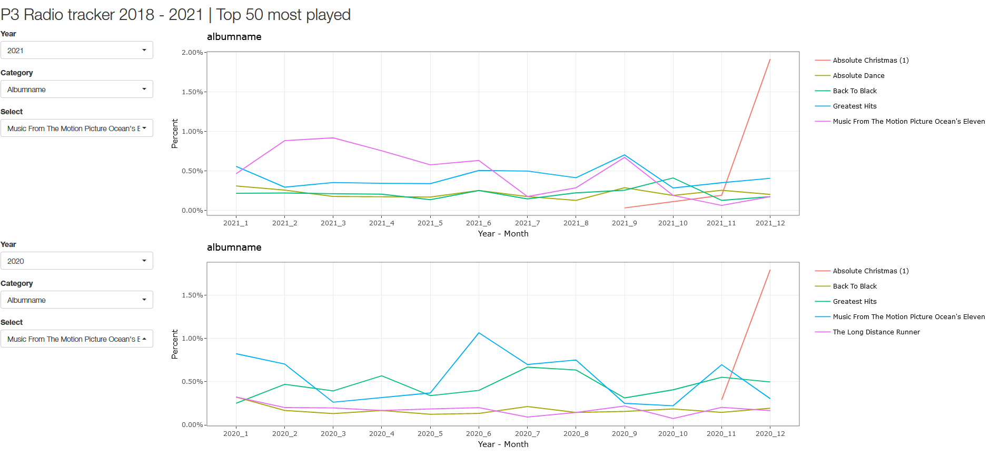
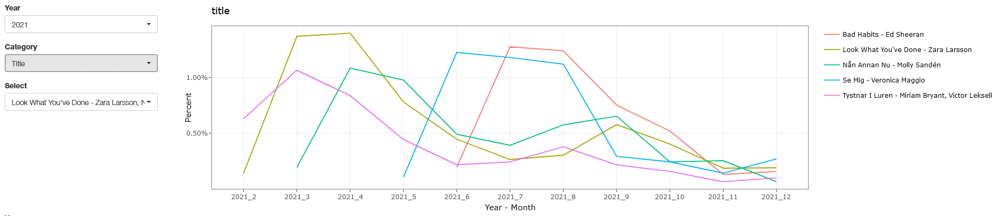

# Introduction

It requires a little bit of skills to be able to build a dashboard from scratch especially if you are not a web programmer, not any more! The library shiny in R utilizes only R code, converts it to html, java and css to make web applications in no time. This is particularly useful when trying to make a downstream analysis in which it requires a lot of plotting and selection settings then shiny is the right tool for you. In this short introduction I describe how to structure a shiny application from scratch, the basic idea of how the parts holds together and lastly I demonstrate a modularized shiny application with code examples. I use the P3 radio data from 2018-01-01 to 2021-12-31 of roughly 400K cases to demonstrate how easy it is to display and plot such results in a sweep. 

# Data acquisition

To collect data for this project I used the P3 API which did not require a personal key. The data
collected is the tableu for songs played on the P3 radio under the period 2018-01-01 to 2021-12-31.
After a little bit of data cleaning, here is the resulting dataframe with around 400K entries.
Here is the link to the documentation if you are interested [LINK](https://api.sr.se/api/documentation/v2/generella_parametrar.html).
The API call was fairly simple and here is the link to the actual script as well [LINK](https://github.com/anjo0511/PR_anjo0511/blob/master/R/00_get_december_data.R).


```{r}
suppressPackageStartupMessages({library(tidyverse)})
suppressMessages({df <- read_csv("../Data/sveriges_radio_P3_2018_2021_TOT.csv")})

print(head(df,n = 3))
```
# Shiny apps in general

To start building a shiny app the first thing you need to do is think about what you want to display. In my case I thought it would be interesting to
make an explorative app in which you can choose a couple of variables from the downloaded data and plot a summary statistic to see how the variable evolves during
the year. The summary statistics will be a table to display the percentage of a variable grouped by year and month. I'm in the process of developing an R package solely dedicated to 
make summary tables easy, check it out here [LINK](https://markitr.github.io/tabulate/articles/intro_tabulate.html). To build a dashboard I used R-shiny which is the easiest way in a single programming language to make a web interface. 

The app is built entirely with R code and the app structure is easy to read, although I admit, the logic can get complex. The two must have files you need 
are 1) app.R, 2) global.R. The global.R file stores the loading of the data and sourcing of additional scripts. The app.R file is where you can code the user interface and server part of the application. If
you have not coded a user interface before it is all about actions or inputs from the user to get a reaction from the server. The app.R file is separated into two parts, the ui and server part, it is possible to 
have these in separate files but I like to have them in the same file to have a better overview. Shiny has a lot of UI options and all it really does is to convert R syntax into html code. The same logic applies as building a basic html page which is to divide the page in rows and columns to get the desired layout. Here is a cheat sheet of Shiny to get a quick idea of how it works [LINK](https://shiny.rstudio.com/images/shiny-cheatsheet.pdf).

There are very good shiny tutorials on Youtube so go there to get started. Each UI element, say a drop-down having five options has to react upon the user selecting one of the alternatives, that is where the server part comes in. The logic of the app is like a chain of events, each happening before the other 'til there is nothing else to do. One extra layer of complexity in the Shiny infrastructure is the idea of reusable modules. The modules allows for a certain part of both the ui and server to be reusable infinite times. This is particularly useful when you want say two plots next to each other with the exact same filter buttons to use with each plot or to insert a plot under a position holder on each press of a button. Here is a link to Shiny modules [LINK](https://shiny.rstudio.com/articles/modules.html). The concept of modules is to be able to isolate each module instance in a separate namespace in order to reuse that code multiple times. 

# My dashboard 

I made a Shiny application with a fluidpage layout and a modularized structure. Each module consists of a three dropdowns 1) year, 2) category and 3) value selection. The first two are taken straight from the downloaded data, the third is which values from the category and year selected that are present in the aggregated data and it automatically updates based on the first two choices. The app selects the top 50 most frequently present values and displays the aggregated results on a time line based on the year selected. Since this is a modularized approach I chose to repeat the module two times to be able to have the same layout twice and be able to compare between different choices. Using a modularized approach saves space in the app.R script and also makes it super easy to repeat code. My entire app.R script looked like the following. The first few rows loaded some libraries and the global.R file. Then the UI part has two modules or the same module used twice. The same stands for the server part, where I used the same module server logic twice.

The modules in this case are called plot_UI and plot_SERVER, for the UI and server parts of the modules respectively. Although the app.R is easy to understand, the module logic is a bit more complex, here is the link to the module I made [LINK](https://github.com/anjo0511/PR_anjo0511/blob/master/R/plot_module.R).


```{r eval=FALSE}
#
#
library(shiny)
source("global.R")

ui <- fluidPage(
  h2("P3 Radio tracker 2018 - 2021 | Top 50 most played"),
  plot_UI("top_module"),
  plot_UI("bottom_module")
)
server <- function(input, output, session) {
  plot_SERVER("top_module", df)
  plot_SERVER("bottom_module",df)
}

shinyApp(ui, server)

```

The resulting layout of the application can be seen below.


# Final words

I found Shiny to be a good tool for quick exploratory analysis. It is possible to make modules to reuse code and also to
create new more complex layouts. Some interesting things I found looking at the data was that the album 'Absolute Christmas' is played every year
from late November to December, see figure 2. The last thing I found was the top played songs of 2021, by google:ing the release dates of the songs, it is
clear that P3 is quite up to date with the latest releases. Overall the project was fun to do and interesting to use Shiny and Shiny modules, I definetly 
recommend it.






